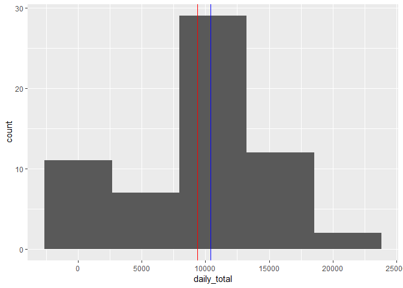
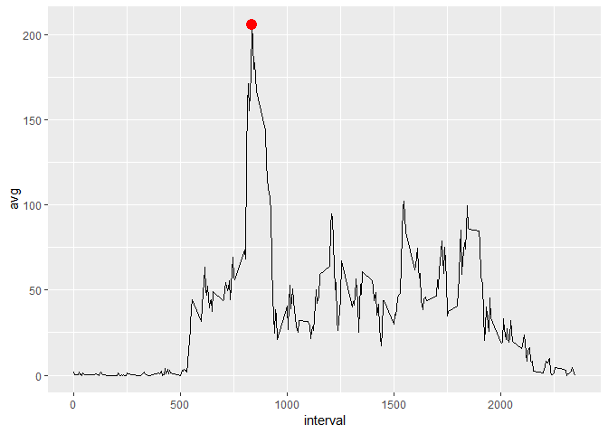
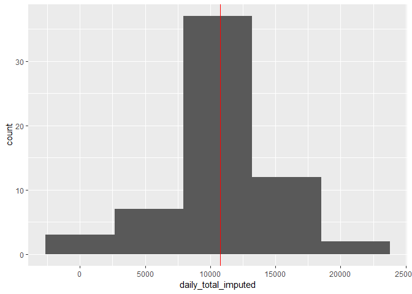
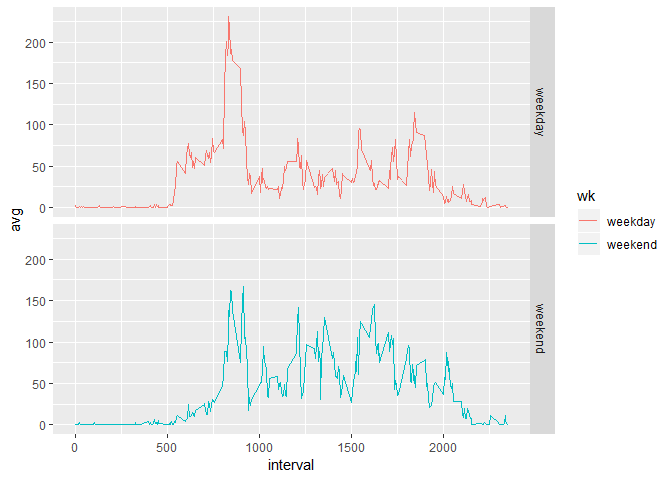

##Loading required packages
Required packages are loaded into R.

```r
library(dplyr)
```

```
## 
## Attaching package: 'dplyr'
```

```
## The following objects are masked from 'package:stats':
## 
##     filter, lag
```

```
## The following objects are masked from 'package:base':
## 
##     intersect, setdiff, setequal, union
```

```r
library(lubridate)
```

```
## 
## Attaching package: 'lubridate'
```

```
## The following object is masked from 'package:base':
## 
##     date
```

```r
library(ggplot2)
```

## Loading and preprocessing the data
The data is read into R and the date column of the dataset is transformed into a datetime object.

```r
amd <- read.csv("activity.csv")
amd$date <- as.Date(amd$date, "%Y-%m-%d")
head(amd)
```

```
##   steps       date interval
## 1    NA 2012-10-01        0
## 2    NA 2012-10-01        5
## 3    NA 2012-10-01       10
## 4    NA 2012-10-01       15
## 5    NA 2012-10-01       20
## 6    NA 2012-10-01       25
```

## What is mean total number of steps taken per day?
The dataset is grouped by date and the sum of steps in each day is taken. The mean and median total number of steps per day is then calculated, ignoring missing values.

```r
amd2 <- tbl_df(amd) %>% group_by(date) %>% summarize(daily_total = sum(steps, na.rm = TRUE))
amd2mean <- mean(amd2$daily_total)
amd2median <- median(amd2$daily_total)
```
The mean total number of steps per day is found to be 9354 while the median is 10395

These calculations are visualized in the following histograms.
The red line represents the mean while the blue line represents the median.

```r
amd2_hist <- ggplot(amd2, aes(daily_total))
amd2_hist + geom_histogram(bins = 5) + geom_vline(xintercept = amd2mean, color = "red") + geom_vline(xintercept = amd2median, color = "blue")
```

<!-- -->

## What is the average daily activity pattern?
The average number of steps taken in each 5-minute interval across all days is plotted in the following time series plot.

```r
amd3 <- tbl_df(amd) %>% group_by(interval) %>% summarize(avg = mean(steps, na.rm = TRUE))
amd3max <- max(amd3$avg)
amd3max_interval <- amd3$interval[amd3$avg == amd3max]

amd3_line <- ggplot(amd3, aes(interval, avg))
amd3_line + geom_line() + annotate("point", x = 835, y = 206, size = 4, color = "red")
```

<!-- -->

On average across all days in the dataset, the 835 5-minute interval has 206.1698113 steps, the largest number of steps among all intervals.

## Imputing missing values
Since no other column contains missing values coded as NA, the total number of missing values is calculated from the steps column with sum. 

```r
missing <- sum(is.na(amd$steps))
```

The dataset has 2304 rows with NA values.

The missing steps data are imputed by replacing the NA values with the average 5-minute interval value across all days. The averages are based on the calculations from the time series plot in the previous section.
The following code creates a new dataset with the missing values filled in.

```r
amd4 <- amd %>% group_by(interval) %>% mutate(steps = ifelse(is.na(steps), amd3$avg[amd3$interval %in% interval], steps))
head(as.data.frame(amd4))
```

```
##       steps       date interval
## 1 1.7169811 2012-10-01        0
## 2 0.3396226 2012-10-01        5
## 3 0.1320755 2012-10-01       10
## 4 0.1509434 2012-10-01       15
## 5 0.0754717 2012-10-01       20
## 6 2.0943396 2012-10-01       25
```

The total number of steps per day is recalculated and the new mean and median displayed in the following histogram.

```r
amd5 <- amd4 %>% ungroup() %>% group_by(date) %>% summarize(daily_total_imputed = sum(steps))
amd5mean <- mean(amd5$daily_total_imputed)
amd5median <- median(amd5$daily_total_imputed)

amd5_hist <- ggplot(amd5, aes(daily_total_imputed))
amd5_hist + geom_histogram(bins = 5) + geom_vline(xintercept = amd5mean, color = "red")
```

<!-- -->

Imputing the data, the new mean and median are 10766 and 10766, coincidentally equal. These centers have a larger value compared with the mean and median from the dataset without imputation. Generally, imputing the data increases the daily estimated total number of steps.

## Are there differences in activity patterns between weekdays and weekends?
The dataset is split into two groups: weekdays and weekends. This split is accomplished by the addition of a new variable indicating whether a certain row was collected on a weekend or weekday based on the date column. The average number of steps taken in each 5-minute interval across weekdays or weekends are then plotted in a time series plot.

```r
amd6 <- amd4 %>% mutate(wk = ifelse(grepl("S(at|un)", weekdays(date, abbr = TRUE)), "weekend", "weekday"))
amd6$wk <- as.factor(amd6$wk)

amd7 <- amd6 %>% group_by(wk, interval) %>% summarize(avg = mean(steps))
amd7_line <- ggplot(amd7, aes(interval, avg, group = wk))
amd7_line + geom_line(aes(color = wk)) + facet_grid(rows = vars(wk))
```

<!-- -->

On average, weekdays have larger peaks before the 1000 5-minute interval. However, steps after the 1000 5-minute mark are larger for weekends compared to weekdays. This weekday pattern may be attributed to the subject's busy commute and subsequent sedentary day job. The weekend pattern is more consistent across the intervals, suggesting a busy and active schedule during the weekends.
